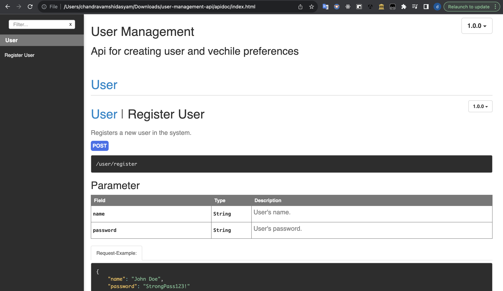
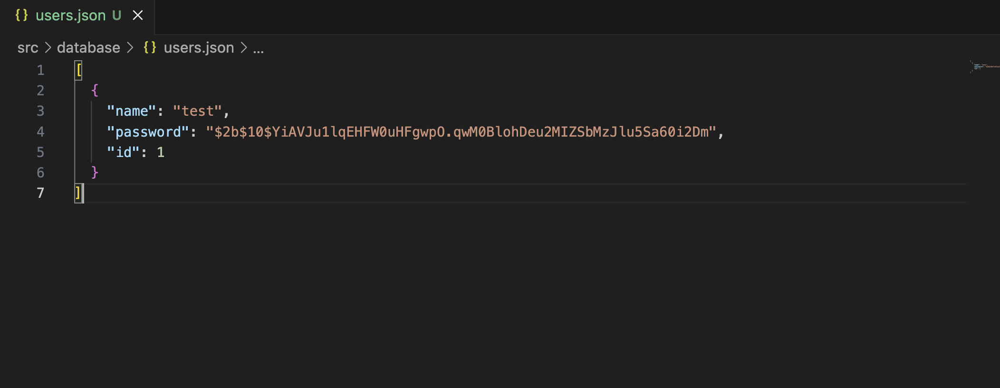
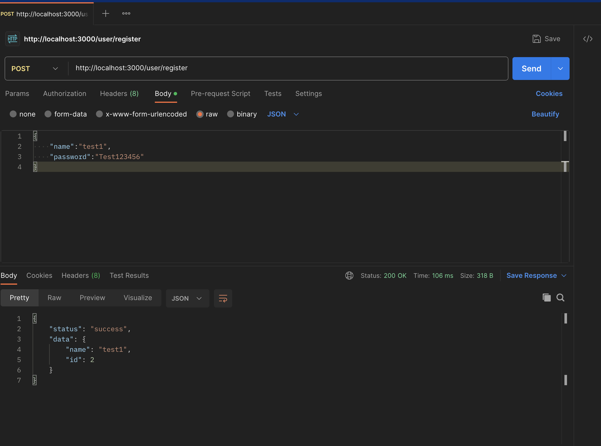
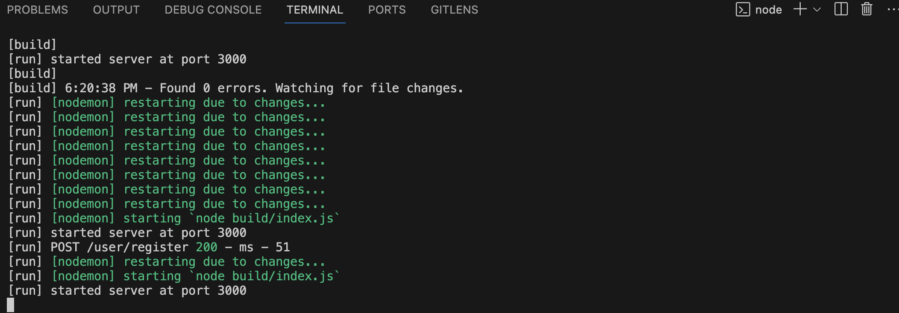
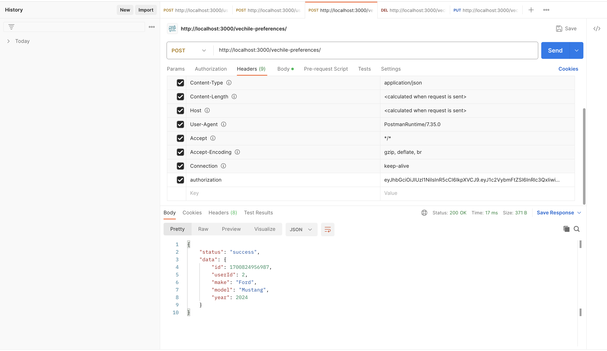
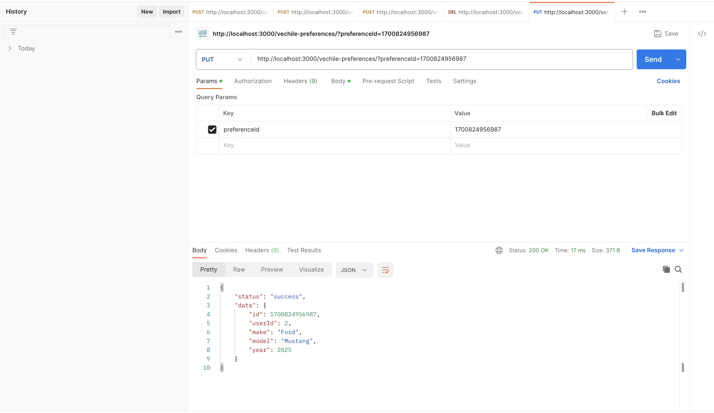
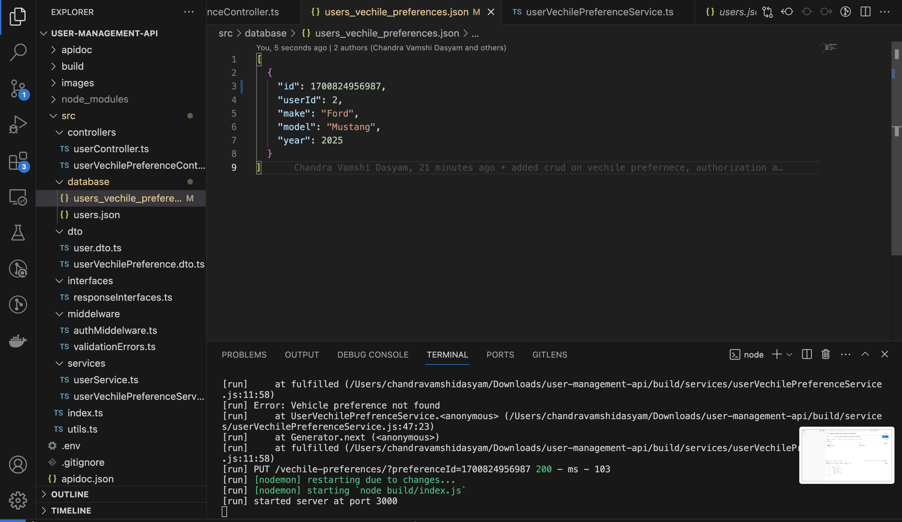
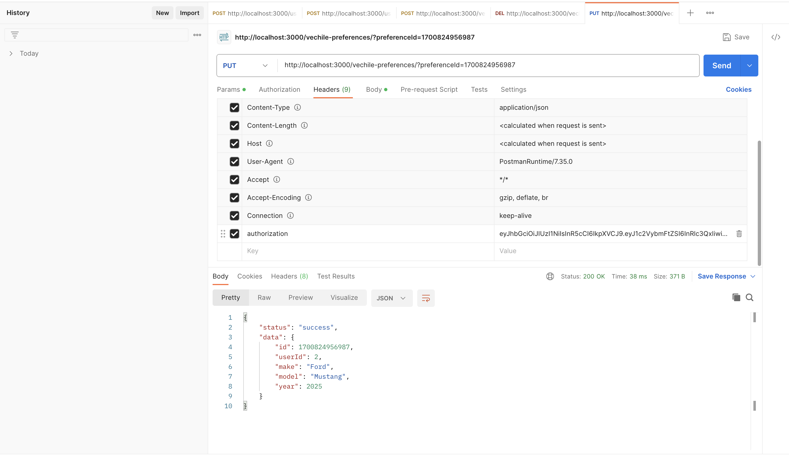

# User Management API (PDR.cloud Technical Challenge)

### what i did (everthing with screenshot explained in this readmefile)
* User Registration and Authentication
* Vehicle Preferences
* Logging
* Documentation(i showed you basic example using apidoc lib)

### Postman
* i used postman for making request so i saved all my request and aded here in this project as cloud it is post man collection json file. 

## I used Node.js, TypeScript, Express, RoutingControllers, ClassValidators 

### Setup
* clone the repo
```sh
$ npm i
```
```sh
$ npm start
```
 npm start will start the server on port 3000 which is .env file. You can change portnumber according to your wish.

 * For generating api doc
 ```sh
  npm install -g apidoc
```
```sh
apidoc -i src/ -o apidoc/
```

 ### Folder Structure

 ```ts
user-management-api/
|-- build/
|-- src/
|   |-- controllers/
|   |   |-- userController.ts // for creating, deleting updating, reading users (endpoints)

|   |-- database/ // I am using json file as db for storing details about user(array of users) and vechiles
|   |   |-- users.json
|   |   |-- vehicle.json

|   |-- dto/ //types
|   |   |-- user.dto.ts // type of user

|   |-- interfaces/ 
|   |   |-- responseInterfaces.ts // interface of responses

|   |-- middelware/
|   |   |-- authMiddleware.ts // authentication middleware for accessing resources
|   |   |-- validationErrors.ts //if we make error request then structured understandable error response is sent

|   |-- services/ //for accessing database
|   |   |-- userService.ts  // for CRUD on users database (users.json)

|   |-- index.ts/ // main file

|-- .env/ // basic project settings

|-- package.json
|-- README.md
|-- tsconfig.json
```

### API DOC example (used apidoc lib) 
* A sample image of API Doc
  

### User 
#### creating user
* Befor creating new user(users.json)
  

* postman request for creating new user
  

* logger i used morgan lib for this
  

* after creating new user(users.json)
  

### User Vechile preferences - only authenticated user can insert the vechile preferences
#### create vechile preference
* Add new vechile preference
  
  

#### update vechile preference
  
  
#### delete vechile preference
  
  


